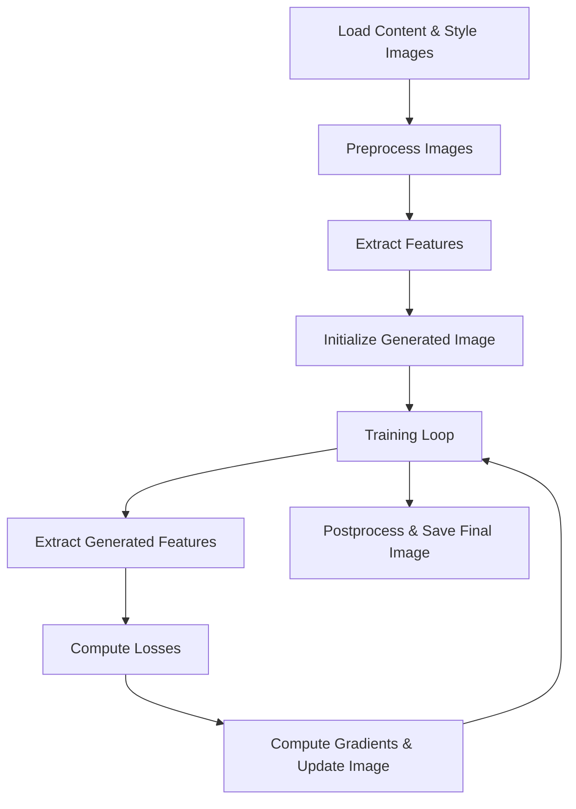

# 🏛️ Neural Style

---

## 🖼️ System Overview

The Neural Style Transfer system is designed as a modular pipeline with the following core components:

<kbd>1</kbd> **Image Preprocessing**  
<kbd>2</kbd> **Feature Extraction (VGG19)**  
<kbd>3</kbd> **Loss Computation**  
<kbd>4</kbd> **Optimization Process**  
<kbd>5</kbd> **Image Postprocessing**

---

## 🔍 Component Details

### 1️⃣ Image Preprocessing
- Resize images to a consistent dimension (default: **400×400**)
- Convert images to tensors
- Apply VGG19-specific preprocessing (channel-wise mean subtraction)

---

### 2️⃣ Feature Extraction
- Employ a **pretrained VGG19** model (without top layers)
- Extract features from multiple layers:
  - **Content Representation:** `block5_conv2`
  - **Style Representation:** `block1_conv1` to `block5_conv1`

---

### 3️⃣ Loss Computation
- **Content Loss:**  
  Mean squared error between content and generated features
- **Style Loss:**  
  Gram matrix comparison between style and generated features
- **Total Variation Loss:**  
  Encourages spatial smoothness in the output image

---

### 4️⃣ Optimization
- Use the **Adam optimizer**
- Iteratively adjust pixel values of the generated image
- Apply gradient clipping to maintain valid pixel range

---

### 5️⃣ Image Postprocessing
- Reverse VGG19 preprocessing
- Convert tensor back to image format
- Clip values to valid RGB range (**0–255**)

---

## 🔄 Data Flow

**Steps:**
1. Load content and style images  
2. Preprocess both images  
3. Extract features from both images  
4. Initialize generated image (copy of content image)  
5. For each training iteration:  
   - Extract features from generated image  
   - Compute content, style, and variation losses  
   - Compute gradients and update the generated image  
6. Postprocess and save the final image

---

## ⚙️ Hyperparameters

| Parameter               | Default Value | Description                        |
|-------------------------|:------------:|------------------------------------|
| `CONTENT_WEIGHT`        |   1e4        | Weight for content loss            |
| `STYLE_WEIGHT`          |   1e-2       | Weight for style loss              |
| `TOTAL_VARIATION_WEIGHT`|    30        | Weight for variation loss          |
| `IMG_WIDTH`             |    400       | Processing width                   |
| `IMG_HEIGHT`            |    400       | Processing height                  |
| `Learning Rate`         |   0.02       | Adam optimizer learning rate       |

---

## 📦 Dependencies

- **TensorFlow 2.x** (for model and optimization)
- **NumPy** (for numerical operations)
- **Pillow** (for image loading/saving)
- **Matplotlib** (optional, for display)

---

> _For more details, refer to the code comments and [README.md](README.md)._
