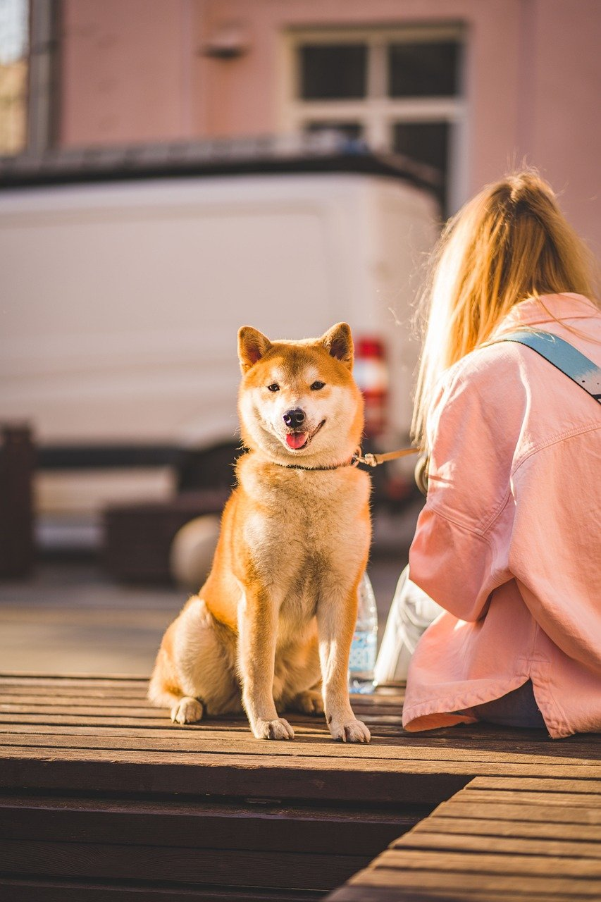

***COMPANY:*** CODTECH IT SOLUTIONS  
***NAME:*** RANGDAL PAVANSAI  
***INTERN ID:*** C0DF200  
***DOMAIN:*** Artificial Intelligence Markup Language (AIML Internship)  
***DURATION:*** 4 WEEKS
***MENTOR:*** NEELA SANTHOSH

# 🎨⚡ Neural Style Transfer with GPU Acceleration

Transform your photos into stunning works of art! This project implements **Neural Style Transfer** using **TensorFlow** and a deep convolutional **VGG19** network, combining the content of one image with the style of another. Optimized for **GPU acceleration** for lightning-fast performance.

---

## 🖼️ What is Neural Style Transfer?

Neural Style Transfer (NST) is a deep learning technique that blends the *content* of one image (like a photograph) with the *style* of another image (like a famous painting). By leveraging a pre-trained **VGG19** model, this project creates visually captivating images through:

- **Content Loss:** Preserves the structure of your content image.
- **Style Loss:** Captures the artistic flair of your style image.
- **Total Variation Loss:** Ensures smoothness and natural transitions.

---

## 🌟 Example Output

| Content Image                         | Style Image                               | Stylized Output                                                    |
| ------------------------------------- | ----------------------------------------- | ------------------------------------------------------------------ |
|  |  |            |

---

## 🚀 Quick Start

### 🛠️ Requirements

Install the dependencies:

```bash
pip install tensorflow=2.10.0 numpy=1.26.4 Pillow=11.2.1 matplotlib=3.10.3 opencv-python=4.11.0.86
```

> **Note:** This script is optimized for **GPU usage**. Make sure your system has a compatible NVIDIA GPU and the correct CUDA/cuDNN drivers installed for TensorFlow.

---

### 📁 Project Structure

```
Neural-Style-Transfer/
│
├── style_transfer.py                   # Main script
├── examples/
│   ├── input_images/
│   │   ├── dog.jpg                     # Content image
│   │   └── beach.jpg                   # Style image
│   └── styled_outputs/
│       └── dog_sunrise.jpg             # Stylized output it will be created by model when it runs
```

---

## 🧠 How Does It Work?

1. **Preprocessing:** Resize and normalize your images.
2. **Feature Extraction:** Use **VGG19** to obtain content and style features from specific layers.
3. **Style Representation:** Calculate **Gram matrices** to encode style.
4. **Optimization:** Iteratively update the output image to minimize a weighted sum of content, style, and variation losses.
5. **Final Output:** Save your artistic, stylized image.

---

## 💻 Usage

Run the script from your terminal:

```bash
python style_transfer.py \
  --content examples/input_images/dog.jpg `
  --style examples/input_images/beach.jpg `
  --output examples/styled_outputs/dog_sunrise.jpg `
  --epochs 10 `
  --steps 100
```

**Arguments:**
- `--content`: Path to the content image.
- `--style`: Path to the style image.
- `--output`: Path for the generated output image.
- `--epochs`: Number of epochs (default: 10).
- `--steps`: Steps per epoch (default: 100).

---

## ⚡ GPU Acceleration

TensorFlow automatically uses available GPUs, but this script also explicitly places critical operations on the GPU for maximum speed:

```python
with tf.device('/GPU:0'):
    # Fast operations here
```

---

## 👤 Author

**Pavansai Rangdal**  
[GitHub](https://github.com/Pavansai20054) • [LinkedIn](https://www.linkedin.com/in/rangdal-pavansai/) • [Gmail](mailto:pavansai.20066@gmail.com)  
[Instagram](https://www.instagram.com/pavansai_rangdal) • [Facebook](https://www.facebook.com/rangdal.pavansai)

---

## 📝 License

Licensed under the **MIT License**. See the [LICENSE](LICENSE) file for details.

---